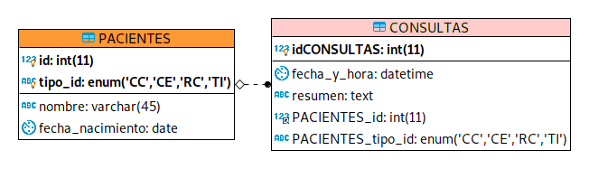
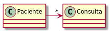

## Escuela Colombiana de Ingeniería

### PDSW – Procesos de desarrollo de Software
### Parcial Segundo Tercio


**IMPORTANTE**

* Deseable Trabajar en Linux (para evitar problemas con las instrucciones finales).
* Se puede consultar en la Web: APIs/Documentación de lenguaje y frameworks (Primefaces, Guice, MyBatis, etc), y enunciados de los laboratorios (se pueden revisar los fuentes incluidos con los dichos enunciados).
* No se permite: Usar memorias USB, acceder a redes sociales, clientes de correo, o sistemas de almacenamiento en la nube (Google Drive, DropBox, etc). El uso de éstos implicará anulación.
* Clone el proyecto con GIT, NO lo descargue directamente.
* NO modifique los indicado en consultaPaciente.xhtml.
* El filtrado y ordenamiento de los datos DEBE realizarse en el motor de base de datos, a través del uso de SQL. Consultar todos los datos y filtrarlos en el servidor de aplicaciones -que es supremamente INEFICIENTE- se evaluará como INCORRECTO.


Se le han dado los fuentes de un avance parcial de una plataforma de consultas de pacientes de una IPS en línea. En esta plataforma los médicos podrán registrar y buscar pacientes así como buscar y registrar las consultas.
Adicionalmente, la secretaria de salud puede hacer búsquedas para control epidemiológico.

Para el Sprint en curso, se han seleccionado las siguientes historias de usuario del Backlog de producto:

Recuerde que en el formato XML no se puede utilizar '<' y '>', por ejemplo al realizar comparaciones, 
 utilice '&amp;lt;' o '&amp;gt;' respectivamente. 

## Historia de usuario #1

  -------------------------------------------------------------------------------------------------------------------------------------------------------------------------------------
  > **Como** Usuario de la plataforma de consultas médicas
  >
  > **Quiero** Poder consultar un paciente a partir de su número y tipo de identificación.
  >
  > **Para** Poder hacer una revisión de las consultas realizadas por un paciente cuyo documento ya conozco, y así evitar la búsqueda por el nombre del paciente.
  >
  > **Criterio de aceptación:** Se debe mostrar la fecha de nacimiento del paciente, su nombre, y cada una de las consultas realizadas. Las consultas deben estar organizadas de la más reciente (mostrados arriba) a la más antígua, y deben mostrar la fecha y el resúmen.
  


## Historia de usuario #2

  -------------------------------------------------------------------------------------------------------------------------------------------------------------------------------------
  > **Como** Usuario de la secretaría de salud de la plataforma
  >
  > **Quiero** Tener un reporte de las consultas de los menores de edad (menóres de 18 años) en las que en el resúmen se encuentren enfermedades contagiosas.
  >
  > **Para** Conocer con rapidez qué pacientes debo revisar y tomar medidas al respecto.
  >
  > **Criterio de aceptación:** El reporte NO debe requerir entrar parámetro alguno. Se considerán como enfermedades contagiosas: 'hepatitis' y 'varicela'. El reporte sólo debe contener el número y tipo de identificación  del paciente y la fecha de nacimiento, ordenados por edad de mayor a menor.
  -------------------------------------------------------------------------------------------------------------------------------------------------------------------------------------

El modelo de base de datos y de clases asociados a la implementación parcial son los siguientes:





A partir de la aplicación base suministrada, debe realizar lo siguiente:

Dado un número y tipo de identificacion de un paciente, mostrar el paciente y las consultas que ha realizado esde paciente.

Mostrar los pacientes menores de edad que en sus consultas se encuentren las enfermedades: hepatitis o varicela.


1.  (20%) A partir de la especificación hecha en los métodos
    *consultarPacientesPorId* y *consultarMenoresConEnfermedadContagiosa* de la fachada de
    servicios (la parte lógica de la aplicación), implemente sólo una prueba (la que considere más importante para validar las especificaciones y los criterios de aceptación). Siga el esquema usado en ServicesJUnitTest para poblar la base de datos volátil y verificar el comportamiento de las operaciones de la lógica.
    
 Consultas en el mapper
 

consulta para menores de edad con enfermedades contagiosas


consulta para saber todas las consultas de dicho paciente.


resultmaps


cada consulta con un resultmap diferente

prueba


prueba ejecutada


2.  (40%) Implemente la historia de usuario #1, agregando todo lo que haga falta en la capa de presentación, lógica y de persistencia. La vista debe implementarse en consultaPaciente.xhtml.

resultado.
  


consulta a dicho paciente con todas sus consultas vista desde el de la plataforma de consultas médicas.

3.  (40%)Implemente la historia de usuario #2, agregando todo lo que haga falta en la capa de presentación, lógica y de persistencia. La vista debe implementarse en consultarMenoresEnfermedadContagiosa.xhtml.

resultado


consulta a pacientes cuyas enfermedades son contagiosas desde el uuario de la secretaría de salud de la plataforma.


## Entrega

1. Documentar la solución en Readme de Git.

## Bono

Si después de realizado el parcial, de forma INDIVIDUAL encuentra defectos menores (que impliquen a lo sumo cambiar 5 líneas de código), y que al corregirlos permiten que los puntos 2 o 3 funcionen:

1. Haga los ajustes en su código.

2. Haga un nuevo commit con el mensaje "entrega bono, ahora funciona el Punto XX" , donde XX es el punto que se corrigió. 

3. Ejecute:

    ```bash
    $ git diff --stat HEAD HEAD^^
    ```

4. Si el resultado del comando anterior es menor o igual a 10, puede aplicar al bono.

5. Comprima la nueva versión siguiendo el esquema indicado en el parcial, y súbalo a más tardar el 24 de Marzo a las 11:59pm en el espacio correspondiente.

